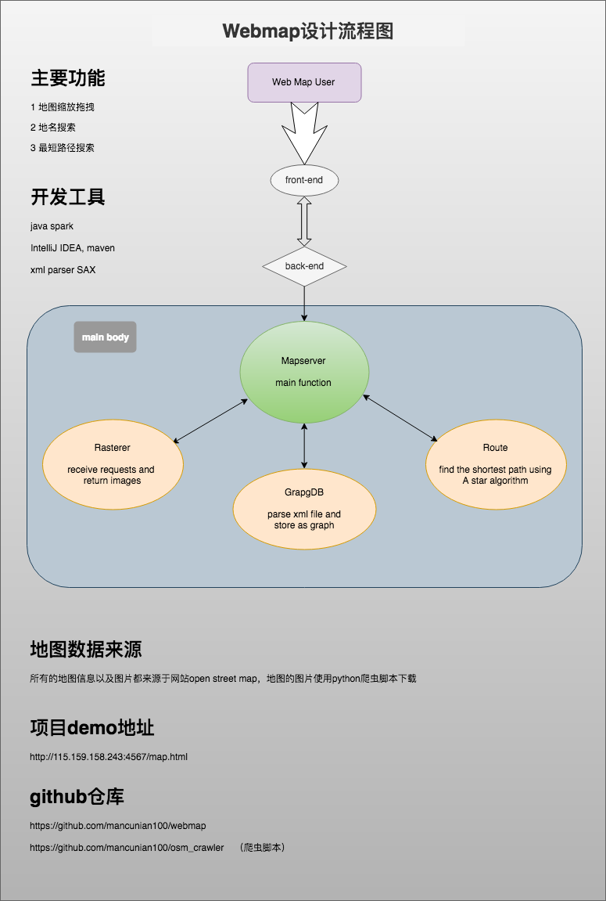

## web map application

- this is a web application based on a java web framework [spark](http://sparkjava.com/).
- it is an modified project from cs61b, thanks for the open access resources of this wonderful course.
- the map data and images are obtained from the [open street map](https://www.openstreetmap.org), and there is another crawler script (in Python3) for downloading the map images.
- features: 1. zooming in and zooming out the map; 2. search the site with the english name; 3. require the shortest path between two loactions;
- usage:   
   - zoom in & out using the -/+ on the keyboard.
   - enter the location's English name to search.
   - double click the map to select the start site, then double click the map to select the destination, and the map will show you a blue line which is the shortest path.

- need to be improved:
   - the images can be vectored tiles instead of pixel tiles.
   - lots of location names in open street map are missing, so it's usually failed to search a location with its name.
   - this application can only support a very small area as a map
   - the performance has room for improvement

- design flow figure:
    

